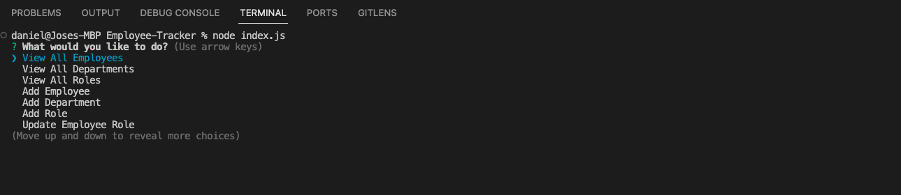

# [Employee Tracker](https://github.com/JMorante89/Employee-Tracker)

  ## Table of Contents
  - [Description](#description📝)
  - [Installation](#installation💻)
  - [Usage](#usage👨‍💻)
  - [Features](#features🎁)
  - [Credits](#credits📣)
  - [Resources](#resources🛠️)
  - [License](#licenses🔍)

## Description📝
The Employee Tracker is a free database application that allows you to manage your company's managers, employees, departments and roles.

## Installation💻
The Employee Tracker may be downloaded using github and used by a source code editor of your choice, like Visual Studio Code to run the program.
- [Source Code Link](https://github.com/JMorante89/Employee-Tracker)
- [Video Tutorial Link](https://drive.google.com/file/d/1kNhHqCg_EFPEqSB7Z9VYCzauC6zYvyTB/view?usp=sharing)

## Usage👨‍💻
### Step 1: 
Begin by ensuring you have Node.js installed on your computer. If not, you can obtain and install it from the official website (https://nodejs.org/).   
Once you have Node.js up and running, you can proceed with the logo generator project installation.

### Step 2:
Download the project files from the source and extract them into a directory of your choice.  
Afterward, open a terminal or command prompt and navigate to the folder where you placed the project files.

### Step 3: 
Now, it's time to set up the project's dependencies, which include Inquirer.js and mysql2.  
To do this, enter the following command in your terminal: 

    npm install

### Step 4: 
Initilize the database by navigating to ./db within the Employee Tracker folder and logging into mysql by typing:
        
    mysql -u root -p.

### Step 5:
Once logged in, type in:
     
    SOURCE schema.sql;

### Step 6:
With the database intialized, you're now ready to use the Employee tracker.  
To run it, execute the following command from the root folder:

    node index.js

### Step 7:
With the database intialized, you're now ready to use the Employee tracker.  

## Features🎁
    -Easy UI to follow  
    -Fast access to Employees, Departments and Roles 
    -Ability to ADD NEW: Employees, Deparments and Roles
    -Easily update Employee Role from your Database

 ## Credits📣
- Daniel Morante 
  [Github Profile JMorante89](https://github.com/JMorante89)

## Resources🛠️
- GWU tutoring

## Licenses🔍
   